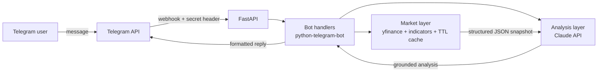

# Nadav 📈🤖

**An AI market analyst that lives in Telegram.** Send a ticker, get live indicators plus a concise, data-grounded analysis written by Claude.

    

<!-- Add a screenshot or GIF of the bot here: it's the first thing people look at -->
<!--  -->

## What it does

| Command | What you get |
|---|---|
| `/analyze NVDA` | Indicator card + AI analysis of trend, momentum and risk |
| `/price TEVA.TA` | Instant indicator card (no LLM call, so it's fast and free) |
| `/compare AAPL MSFT GOOGL` | Side-by-side comparison of 2-4 tickers |
| `/market` | Pulse of S&P 500, Nasdaq, Dow, VIX and TA-125 |
| `/myid` | Your Telegram user ID (for `AI_ALLOWED_USER_IDS`) |
| just type `btc-usd` | Shortcut for `/analyze` |

AI analysis runs as a private demo: only Telegram users listed in `AI_ALLOWED_USER_IDS` get Claude's write-up. Everyone else still gets the indicator cards, and `/price` and `/market` stay open to all.

Works with stocks, indices, crypto, FX and non-US exchanges, including Tel Aviv (`.TA`). Analysis language is configurable (English / Hebrew).

**Watchlist dashboard.** The same server hosts a web dashboard (`/`) for tracking tickers. Each one gets live indicators, a set of technical signals (▲ bullish / ▼ bearish), a 1-5 score and a Buy / Hold / Sell stance. The list is stored in SQLite.

<!--  -->

## Architecture



```
app/
├── market.py     # Fetch OHLCV, compute RSI / SMA / volatility / volume ratio, cache
├── signals.py    # Rule-based technical signals -> 1-5 score -> Buy / Hold / Sell
├── watchlist.py  # SQLite-backed watchlist
├── analysis.py   # Prompts + Claude API client
├── bot.py        # Telegram handlers, formatting, rate limiting
├── main.py       # FastAPI: webhook, dashboard, /api/watchlist, /api/snapshot/{ticker}
├── polling.py    # Bot-only local entry point (no public URL needed)
├── config.py     # Typed settings via pydantic-settings
└── static/
    └── dashboard.html  # Watchlist dashboard (vanilla JS, light + dark)
```

## Design decisions

**The LLM never sees raw prices or the internet, only numbers I computed.**
`market.py` turns a year of daily prices into a small JSON snapshot (RSI(14), SMA 20/50/200, 30-day annualized volatility, distance from 52-week high, volume vs. 20-day average). Claude is instructed to reason *only* over that JSON. This keeps the analysis factual, cheap (small prompts) and auditable: every claim in the output can be traced to a field.

**The stance comes from rules, not from the LLM.**
The dashboard's Buy / Hold / Sell is computed in `signals.py` from fixed conditions: price vs. SMA 200, stacked moving averages, RSI extremes, 3-month momentum, distance from the 52-week high and heavy volume. Each bullish signal counts +1 and each bearish one -1, and every 2 net points move the score one step from a neutral 3. The trend signals overlap, so one point per signal would push almost every uptrend to 5; halving keeps the scale graded. Every stance lists the signals behind it and is covered by unit tests. Claude in the Telegram bot still describes the setup without prescribing trades.

**Deterministic math, generative narrative.**
Indicators are computed in pure, unit-tested Python functions. The LLM does what it's good at, which is turning numbers into a readable story, and none of what it's bad at, which is arithmetic.

**Built for real users, not just a demo.**
- Per-user cooldown so one user can't burn the API budget
- Allowlist of Telegram user IDs for Claude calls (`AI_ALLOWED_USER_IDS`), checked before the daily cap so other users never spend the shared budget
- Global daily cap on Claude calls (`DAILY_AI_LIMIT`, resets at midnight UTC, persisted in SQLite); past it, users still get the indicator card
- TTL cache so repeated requests for popular tickers don't hit Yahoo again
- Blocking yfinance calls run in a thread pool so the event loop stays responsive
- Graceful degradation: if Claude is down, users still get the indicator card
- HTML escaping on everything, plus truncation to Telegram's 4096-char limit
- Webhook endpoint verifies Telegram's secret token header (constant-time compare), and the app refuses to start in webhook mode with a placeholder or short secret, since a guessable one would let anyone forge updates from an allowlisted user

**Two run modes, one codebase.** Long polling for local development, FastAPI webhook for production. The same FastAPI app also exposes `/api/snapshot/{ticker}`, so the market layer is reusable beyond Telegram.

## Run it locally

```bash
git clone https://github.com/GiliGerson/nadav-bot.git
cd nadav-bot
python -m venv .venv && source .venv/bin/activate
pip install -r requirements-dev.txt

cp .env.example .env   # add your TELEGRAM_BOT_TOKEN (from @BotFather) and ANTHROPIC_API_KEY
                       # and leave WEBHOOK_BASE_URL empty for local runs
uvicorn app.main:app   # bot (long polling) + dashboard on http://localhost:8000
```

Open http://localhost:8000 for the dashboard, then open your bot in Telegram and send `/start`.
To unlock AI analysis for yourself, send `/myid` to the bot, put the number in `AI_ALLOWED_USER_IDS` in `.env`, and restart.
For the bot alone, `python -m app.polling` works too.

## Deploy (webhook mode)

Any host that runs Docker works (Render, Railway, Fly.io):

1. Deploy this repo using the included `Dockerfile`.
2. Set the env vars from `.env.example`, including `WEBHOOK_BASE_URL` (your app's public URL) and a random `WEBHOOK_SECRET` of 32+ characters (`python -c "import secrets; print(secrets.token_urlsafe(32))"`).
3. On startup the app registers its webhook with Telegram automatically. Check `GET /health`.

## Tests

```bash
pytest -q        # indicator math, prompt grounding (mocked Claude client), formatting/escaping
ruff check .
```

CI runs both on every push via GitHub Actions.

## Roadmap

- [ ] Scheduled daily digest for a personal watchlist
- [ ] Price alerts (e.g. "notify me if RSI < 30")
- [ ] Chart image rendered alongside the analysis
- [ ] Persistent storage (Postgres/Redis) for watchlists and shared cache

## Disclaimer

Educational project. Nothing here is financial advice. Market data comes from Yahoo Finance via `yfinance` and may be delayed.

---

Built by [Gili Gerson](https://github.com/GiliGerson)
