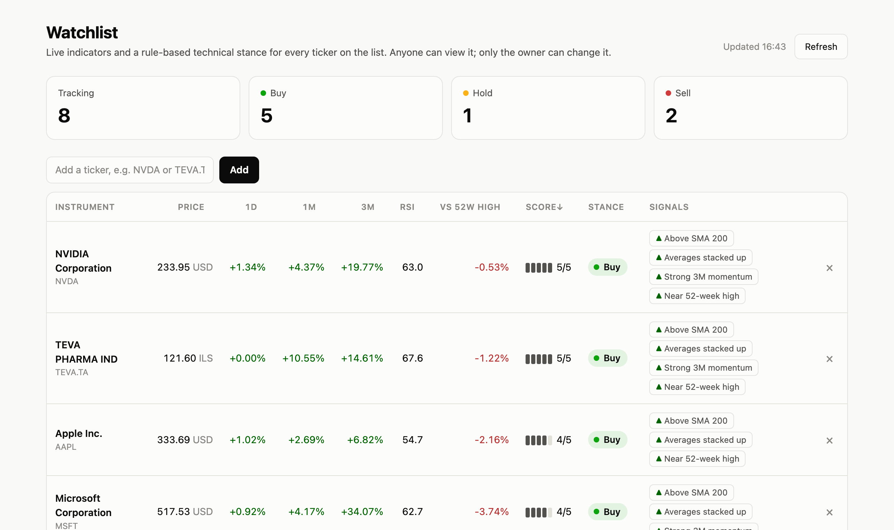
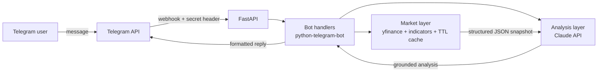

# Nadav 📈🤖

**An AI market analyst that lives in Telegram.** Send a ticker, get live indicators plus a concise, data-grounded analysis written by Claude.

**[Live page →](https://nadav-bot-pearl.vercel.app)** · **[Live dashboard →](https://nadav-bot-0prm.onrender.com)** · **[Try the bot in Telegram →](https://t.me/NadavFinancialBot)**

    

<!-- Add a screenshot or GIF of the bot here: it's the first thing people look at -->
<!--  -->

## What it does

| Command | What you get |
|---|---|
| `/analyze NVDA` | Indicator card + AI analysis of trend, momentum and risk |
| `/price TEVA.TA` | Instant indicator card (no LLM call, so it's fast and free) |
| `/compare AAPL MSFT GOOGL` | Side-by-side comparison of 2-4 tickers |
| `/market` | Pulse of S&P 500, Nasdaq, Dow, VIX and TA-125 |
| `/myid` | Your Telegram user ID (for `AI_ALLOWED_USER_IDS`) |
| just type `btc-usd` | Shortcut for `/analyze` |

Anyone can try the AI analysis: each person gets 3 free AI write-ups a day (30 a day across all visitors), while the owner, listed in `AI_ALLOWED_USER_IDS`, has a separate quota. Past the limit, users still get the indicator cards, and `/price` stays unlimited.

Works with stocks, indices, crypto, FX and non-US exchanges, including Tel Aviv (`.TA`). Analysis language is configurable (English / Hebrew).

**Watchlist dashboard.** The same server hosts a public, read-only web dashboard (`/`) for tracking tickers; only the owner can change the list. Each one gets live indicators, a set of technical signals (▲ bullish / ▼ bearish), a 1-5 score and a Buy / Hold / Sell stance. The list is stored in SQLite.

<!--  -->

## Architecture



```
app/
├── market.py     # Fetch OHLCV, compute RSI / SMA / volatility / volume ratio, cache
├── signals.py    # Rule-based technical signals -> 1-5 score -> Buy / Hold / Sell
├── watchlist.py  # SQLite-backed watchlist
├── analysis.py   # Prompts + Claude API client
├── usage.py      # Global daily cap on Claude calls (SQLite counter)
├── bot.py        # Telegram handlers, formatting, access gates
├── ratelimit.py  # Per-user sliding-window rate limiter, bounded memory
├── security.py   # Dashboard auth, CSRF guard, security headers
├── main.py       # FastAPI: webhook, dashboard, /api/watchlist, /api/snapshot/{ticker}
├── polling.py    # Bot-only local entry point (no public URL needed)
├── config.py     # Typed settings via pydantic-settings
└── static/
    └── dashboard.html  # Watchlist dashboard (vanilla JS, light + dark)
```

## Design decisions

**The LLM never sees raw prices or the internet, only numbers I computed.**
`market.py` turns a year of daily prices into a small JSON snapshot (RSI(14), SMA 20/50/200, 30-day annualized volatility, distance from 52-week high, volume vs. 20-day average). Claude is instructed to reason *only* over that JSON. This keeps the analysis factual, cheap (small prompts) and auditable: every claim in the output can be traced to a field.

**The stance comes from rules, not from the LLM.**
The dashboard's Buy / Hold / Sell is computed in `signals.py` from fixed conditions: price vs. SMA 200, stacked moving averages, RSI extremes, 3-month momentum, distance from the 52-week high and heavy volume. Each bullish signal counts +1 and each bearish one -1, and every 2 net points move the score one step from a neutral 3. The trend signals overlap, so one point per signal would push almost every uptrend to 5; halving keeps the scale graded. Every stance lists the signals behind it and is covered by unit tests. Claude in the Telegram bot still describes the setup without prescribing trades.

**Deterministic math, generative narrative.**
Indicators are computed in pure, unit-tested Python functions. The LLM does what it's good at, which is turning numbers into a readable story, and none of what it's bad at, which is arithmetic.

**Built for real users, not just a demo.**
- Graceful degradation: if Claude is down or the daily AI cap is reached, users still get the indicator card
- TTL cache so repeated requests for popular tickers don't hit Yahoo again
- Blocking yfinance calls run in a thread pool, and up to 8 updates are handled concurrently, so one slow request never stalls everyone else
- Per-user cooldown between AI analyses, on top of the limits in [Security](#security)
- Replies fit Telegram's 4096-char limit

**Two run modes, one codebase.** Long polling for local development, FastAPI webhook for production. The same FastAPI app also exposes `/api/snapshot/{ticker}`, so the market layer is reusable beyond Telegram (send `X-Nadav-Dashboard: 1`, plus the dashboard credentials once deployed).

## Security

The bot is open to anyone on Telegram and the server has a public URL, so it's built assuming hostile users. Each defense below is covered by tests, and the codebase went through an independent security review whose findings are fixed.

| Threat | Defense |
|---|---|
| Strangers running up the Claude bill | Visitors share a small public quota: 3 AI calls per person per day (`PUBLIC_AI_PER_USER_DAILY`) and 30 for all of them together (`PUBLIC_AI_DAILY_LIMIT`). The owner's IDs (`AI_ALLOWED_USER_IDS`) draw on a separate quota (`DAILY_AI_LIMIT`), so strangers can't exhaust it. Every quota is reserved atomically in SQLite before Claude is called, all or nothing, so concurrent or refused requests never overshoot or waste a slot. A hard monthly spend limit on the API account is the last line of defense. |
| Forged Telegram updates "from" an allowlisted user | The webhook's secret header is compared in constant time, the app refuses to start with a placeholder or short secret, and the webhook route only exists in webhook mode. |
| Someone editing the watchlist or abusing the API | The dashboard is a public, read-only demo list; adding or removing tickers and the raw `/api/snapshot` endpoint need HTTP Basic auth, required (16+ chars) on any public deployment. The Docker image marks itself public, so it can't start without a password. API docs are disabled in production. |
| Malicious websites acting through the owner's browser | Every API call needs a custom header that cross-site requests can't send (the CORS preflight is never granted), which blocks CSRF. Locally, only `localhost` Host headers are answered, which blocks DNS rebinding. |
| XSS and injection | Telegram output is HTML-escaped (truncated *before* escaping, so entities are never split), the dashboard renders with `textContent` only, and a Content-Security-Policy allows just the page's own script by SHA-256 hash. SQL is parameterized and tickers are validated against a strict regex. |
| Flooding the bot or the server | A per-user rate limit on every command (`USER_REQUESTS_PER_MINUTE`), capped parallel Yahoo fetches, cached "not found" results, a 4 KB body limit on API writes (FastAPI parses bodies before auth runs) and bounded in-memory caches. Group chats are ignored. |
| Leaking secrets or personal data | Secrets live only in env vars, kept out of git and Docker images (`.gitignore`, `.dockerignore`). HTTP request logging is silenced because Telegram URLs contain the bot token. Personal data is served with `no-store`. |
| Supply chain and infrastructure | The container runs as an unprivileged user, CI has a read-only token and runs `pip-audit`, and Dependabot opens weekly update PRs. |

## Run it locally

```bash
git clone https://github.com/GiliGerson/nadav-bot.git
cd nadav-bot
python -m venv .venv && source .venv/bin/activate
pip install -r requirements-dev.txt

cp .env.example .env   # add your TELEGRAM_BOT_TOKEN (from @BotFather) and ANTHROPIC_API_KEY
                       # and leave WEBHOOK_BASE_URL empty for local runs
uvicorn app.main:app   # bot (long polling) + dashboard on http://localhost:8000
```

Open http://localhost:8000 for the dashboard, then open your bot in Telegram and send `/start`.
To unlock AI analysis for yourself, send `/myid` to the bot, put the number in `AI_ALLOWED_USER_IDS` in `.env`, and restart.
For the bot alone, `python -m app.polling` works too.

## Deploy (webhook mode)

Any host that runs Docker works (Render, Railway, Fly.io):

1. Deploy this repo using the included `Dockerfile`.
2. Set the env vars from `.env.example`: `TELEGRAM_BOT_TOKEN`, `ANTHROPIC_API_KEY`, `AI_ALLOWED_USER_IDS`, a `DASHBOARD_PASSWORD` of 16+ characters, and a random `WEBHOOK_SECRET` of 32+ characters (`python -c "import secrets; print(secrets.token_urlsafe(32))"`).
3. Set `WEBHOOK_BASE_URL` to the app's public URL. On Render this is automatic (it reads `RENDER_EXTERNAL_URL`).
4. Attach a persistent disk at `/app/data` if the host offers one. Without it, the watchlist and the daily AI counter reset whenever the container restarts (e.g. on Render's free plan, which also sleeps after 15 idle minutes; the first message then takes about a minute, and is kept rather than dropped).
5. On startup the app registers its webhook with Telegram automatically. Check `GET /health`.

Once deployed, local polling refuses to start with the same bot token, since it would switch the deployed bot off. Use a separate test bot locally, or set `FORCE_POLLING=true` to take the bot back on purpose.

## Tests

```bash
pytest -q        # indicators, signals, prompt grounding (mocked Claude), access control, security
ruff check .
```

CI runs both on every push via GitHub Actions, plus `pip-audit` for known vulnerabilities in dependencies.

## Roadmap

- [ ] Scheduled daily digest for a personal watchlist
- [ ] Price alerts (e.g. "notify me if RSI < 30")
- [ ] Chart image rendered alongside the analysis
- [ ] Persistent storage (Postgres/Redis) for watchlists and shared cache

## Disclaimer

Educational project. Nothing here is financial advice. Market data comes from Yahoo Finance via `yfinance` and may be delayed.

---

Built by [Gili Gerson](https://github.com/GiliGerson)
